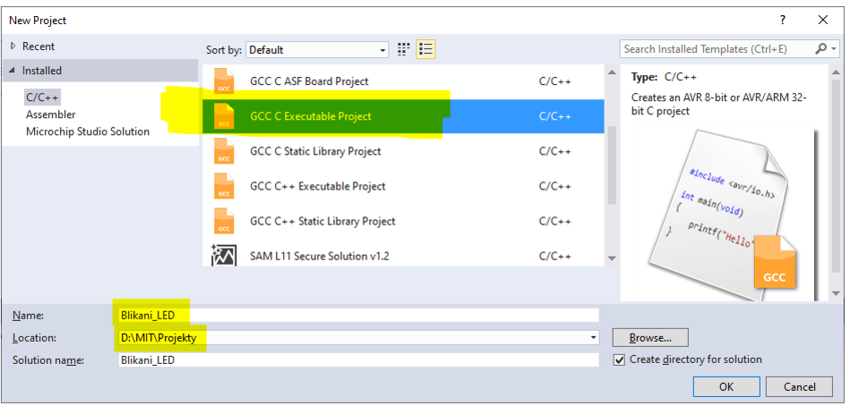
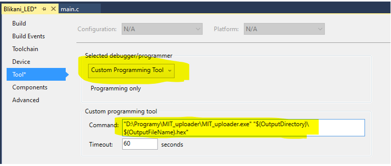
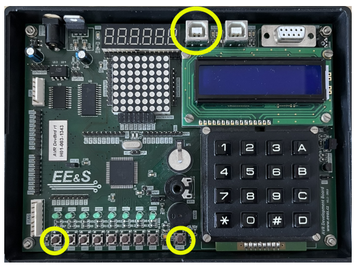
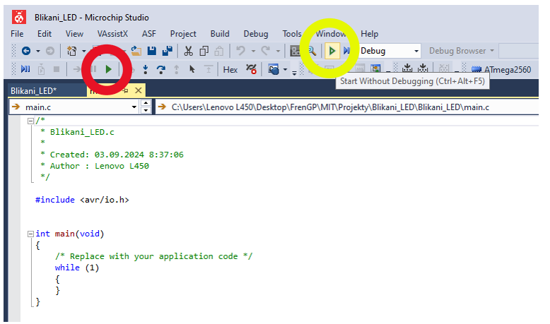

# Výukový přípravek, nahrání programu
Na této stránce najdete základní informace k tomu, jak používat výukový přípravek. Níže jsou odkazy na jeho schéma a datasheet k použitému mikrokontoleru. Dále je zde návod, jak vytvořit pro desku nový projekt v Michrochip studiu a jak pak program nahrát do přípravku.

## Vývojová deska
Na cvičení budeme používat vývojovou desku s mikrokontrolerem ATMEGA 2560, tedy stejným jako je použit v známé desce Arduino MEGA. 
Kromě samotného mikrokontroleru a nutných obvodů jako napájení, zdroj hodinového signálu atd. obsahuje deska mnoho periferií
- Sadu tlačítek
- Sadu LEDek
- Potenciometr
- Bzučák
- Klávesnice
- LCD displej 
- Sedmisegmentový displej
- Maticový displej
- Teplotní senzor
- Modul reálného času

*Vývojová deska používaná na cvičeních*


## Dokumentace k přípravku a k mikrokontroleru

[Data sheet procesoru ATMEGA 2560](files/Atmel-AVR-2560_datasheet.pdf)

[Schema vývojové desky](files/Development_board_schematics.pdf)

[Návod k vývojové desce](files/Development_board_manual.pdf)

[Kniha programujeme AVR v jazyku C](files/Programujeme_AVR_kniha.pdf)


## Template projektu
Abyste nemuseli pro každý nový projekt opakovat kroky popsané níže, můžete si do Microchip studia naimportovat template (šablonu) projektu.

[Template ke stažení zde](files/MIT_AVR_Project.zip)

File ->Import -> Project Template a vyberte stažený zip. soubor. Pokud ve vaší verzi Microchip studia tato možnost v menu není, vyvolejte ji klávesovou zkratkou ```CTRL + T``` .

Pokud pak kliknete na File -> New -> Project tak byste měli v nabídce vidět i "MIT AVR Project". Když ho zvolíte tak všechny níže popsané natsavení budete mít automaticky.


## Vytvoření projektu v Microchip studiu, nahrání programu

Stáhněte do počítače [program pro flashování přípravku](https://github.com/TomasChovanec/MIT_uploader/blob/main/executable/MIT_uploader.zip) a rozbalte ho do ```D:/Programy/```

Spusťe Microchip Studio (dříve Atmel Studio), v menu v horní liště zvolte File -> New -> Project


Budeme zpravidla tvořit spustitelný program v C, zvolte tedy "GCC C Executable Project". 
**Pojmenujte si svůj projekt** (tématem cvičení nebo alespoň pořadovým číslem cvičení) **V názvu nepoužívejte diakritiku**, způsobuje to pak problémy při překladu kódu..



Dále musíme vybrat,  pro jaký mikrokontroler budeme program psát. My máme na přípravku osazen ATmega 2560. Nejsnažší je zadat číslo do vyhledávacího pole, a vyfiltruje se nám náš procesor.


Dále nastavíme způsob nahrávání programu do mikroprocesoru. Stiskněte na horní liště tlačítko se symbolem kladívka. Pak vyberte **"Custom Programming Tool"** a do políčka Coémmand zkopírujte následující příkaz.

```
"D:\Programy\MIT_uploader\MIT_uploader.exe" "$(OutputDirectory)\$(OutputFileName).hex"
```




Než začneme nahrávat program, musíme přípravek přepnout do bootloaderu - módu kdy nevykonává program, ale očekává po USB nahrání nového programu. To provedeme současnám stiskem tlačítka **RESET** a tlačítka **SW7**. Že se přepnutí do bootloaderu podařilo poznáme podle blikajícíh LEDek a inforemace na LCD displeji. USB kabel musí být na přípravku připojen do portu s označením **BOOTLOADER**. 



Nahrání programu provedeme stiskem tlačítka **Start without debugging** s ikonou zeleného "play" bez výplně. Nepoužívejte zelené tlačítko s výplní, to slouží k práci s debuggerem, který teď nemáme připojen.



Po stisku tlačítka **Start without debugging** se program nejprve přeloží. Pokud máte v programu nějaké syntaktické chyby, Michrochip studio vám vypíše seznam chyb a program se nenahraje. 

**Nezapomeňte před každým nahráním programu přepnout desku do bootloaderu, jinak se program nenahraje.**


## [Zpět na obsah](README.md)
