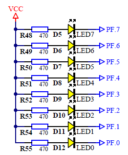

# Blikání LEDkou, práce s registry
Začneme jednoduchým úkolem - chceme blikat LEDkami na výukové desce. Nejprve se podíváme do schématu desky, jak jsou LEDky připojeny k procesoru.



Ze schématu  vidíme, že LEDky jsou připojeny k portu F. Kladné elektrody jsou přes odpor připojené k Vcc (+5V), záporné elektrody jsou připojeny k pinům procesoru. Tedy když je na pinu procesoru logická 0, LEDKa svítí, pokud je na pinu logická 1, LEDka nesvítí. 

## Registry pro práci s porty mikrokontroleru
Funkce mikroprocesoru nastavujeme zápisem do příslušných registrů. V tuto chvíli nám pro ovládání LEDek postačí jen první dva registry.

### DDRx - Data direction register
Protože většina pinů procesoru lze použít jako vstup nebo jako výstup, musíme nejprve nastavit piny k LEDkám jako výstupní. K tomu slouží pro každý port registr **DDRx**, kde x je písmeno portu. V našem případě tedy **DDRF**. Každý bit v tomto registru ovládá jeden pin portu F. Pokud je bit 0, pin se používá jako vstupní, pokud je bit 1, pin je nastaven jako výstup.

### PORTx - Port data  register
To, zda je na pinu +5V (logická 1) nebo 0V (logická 0) lze nastavit pomocí registru **PORTx**, kde x je písmeno portu. V našem případě tedy **PORTF**

**Příklad stavu registru PORTF a stavu LEDek:**

|Pořadí bitu| 7    | 6    | 5    | 4    | 3    | 2    | 1    | 0    | 
|:----:|:----:|:----:|:----:|:----:|:----:|:----:|:----:|:----:| 
|**Název**|  **PORTF7** | **PORTF6** | **PORTF5** |  **PORTF4** | **PORTF3** | **PORTF2** | **PORTF1** | **PORTF0** | 
|**Hodnota**| **0**    | **0**    | **0**   | **1**   | **1**    | **1**   |  **0**   |  **1**   | 
|**LEDky**|🟡    | 🟡    | 🟡    | ⚪    | ⚪    | ⚪    | 🟡    | ⚪    | 

### PINx - Input pin  register
Slouží pro čtení stavu pinu, pokud je použit jako vstupní. Pro blikání LEDkami ho potřebovat nebudeme, ale využijeme ho hned až k LEDkám přidáme tlačítka.

## Blikání LEDkami
Začneme jednoduše a budeme blikat všemi LEDkami zároveň. Nastavíme všech 8 pinů portu F jako výstupní, tedy do každého bitu zapíšeme jedničku:

``` DDRF = 0b11111111; ```

Teď když jsou piny nastavené jako výstup, můžeme měnit jejich stav. K tomu slouží registr **PORTx**, v našem případě tedy **PORTF**.

Ze schématu víme, že LEDky rozsvítíme, pokud na všechny piny nastavíme logickou 0:

``` PORTF = 0b00000000; ```

A LEDKy zhasneme zápisem logické 1 na všechny piny:

``` PORTF = 0b11111111; ```

Program pro blikání všemi LEDKami najednou může tedy vypadat třeba takto:

```c
#include <avr/io.h> // soubor definicemi adres registru, abychom mohli pouzivat symbolicke nazvy jako "PORTB" namisto ciselne adresy registru
#define F_CPU 16000000 // definice frekvence procesoru, v nasem pripade 16MHz aby spravne fungovala funkce delay
#include <util/delay.h> // pridani knihovny s funkci delay

int main(void)
{
  DDRF = 0b11111111; //nastavi vsechny piny portu F jako vystupy
  
  while (1) //nekonecna smycka
  {
    PORTF = 0b00000000; // vsechny piny portu F nastavi jako 0 ->LEDky se rozsviti
    _delay_ms(500); // cekani 500ms

    PORTF = 0b11111111; // vsechny piny portu F nastavi jako 1 ->LEDky zhasnou
    _delay_ms(500); // cekani 500ms
  }
}

```

# Shrnutí

Pro ovládání pinů procesoru AVR slouží tyto registry:

| Registr | Popis                                              | 
|:-------:| :------------------------------------------------ | 
| DDRx    | Nastaví piny daného portu jako vstup nebo výstup   | 
| PORTx   | Nastaví na pinech portu log 1 nebo 0 (+5V nebo 0V) | 
| PINx    | Přečte stav pinu (pokud ho používáme jako vstup)   | 

Každý bit odpovídá jednomu pinu procesoru.

## [Zpět na obsah](README.md)

