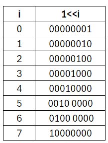
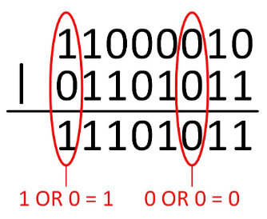
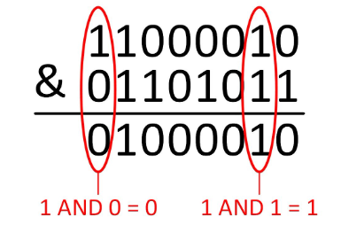
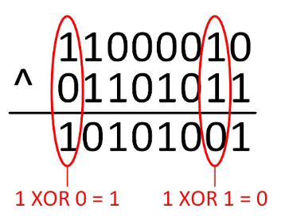

# Převody číselných soustav, bitové operace
V mikroprocesorové technice potřebujeme často pracovat s čísly na úrovni bitů - když chceme přečíst stav jen jednoho tlačíka a ne všech osmi, když chceme zhasnout jen jednu LEDku a ostatní nechat svítit, atd. Proto je dobré ovládat základní převody mezi desítkovou (neboli decimální), šestnáctkovou (neboli hexadecimální) a dvojkovou (neboli binární). Složitější počty a převody je samozřejmě běžné dělat na kalkulačce, ale základní operace budeme používat natoli k často, že se vyplatí je umět z hlavy.

Protože počítače používají binární soustavu, mohli bychom vše psát binárně. Ovšem u větších čísel je binární zápis dlouhý a nepřehledný. Proto se v praxi používá obvykle hexadecimální zápis, který lze do binárního snadno z hlavy převést.

Pozn. pokud používáte českou klávesnici, budou se vám hodit následující klávesové zkratky pro psaní znamének logických operací:

| Znak   | Kláv. zkratka na CZ klávesnici   | 
|:---:|:---:|
| &   | Alt Gr + c   | 
| \|   | Alt Gr + w   |
| ^   | Alt Gr + 3   |
| ~   | Alt + 126   |

## Převod z binární do hexadecimální soustavy

V hexadecimální soustavě může každá číslice nabývat hodnot od nuly do patnácti. Číslice 0-9 jsou stejné jako jsme zvyklí z desítkové soustavy, dále pak 10 píšeme jako A, 11 jako B, atd až 15 jako F.


Při převodu z binární do hexadecimální soustavy si binární číslo rozdělíme na čtveřice (začneme zprava. Nad číslice v každé čtveřici si napíšeme "váhy" jednotlivých cifer, 8-4-2-1. Každá bitová čtveřice nám vytvoří jednu hexadecimální číslici. Abychom ji získali, sečteme jen ty váhy, pod kterými je jednička. V příkladu níže tedy sečteme váhy 1 + 4. Výsledek je 0x5.


```
      8 4 2 1
bin:  0 1 0 1 = 4 + 1 = 0x5 
```

V dalším příkladu je součet vah 15, tedy v hexadecimální soustavě 0xF.

```
      8 4 2 1
bin:  1 1 1 1 = 8 + 4 + 2 + 1 = 15 = 0xF
```

Pokud máme více čtveřic bitů, postup je stále stejný - každou čtveřici bitů převedeme na jednu hexadecimální číslici:
```
      8 4 2 1  8 4 2 1
bin:  1 1 1 1  0 1 0 1 = 0xF5
```

```
      8 4 2 1  8 4 2 1  8 4 2 1
bin:  1 0 1 0  1 1 1 0  1 1 0 0 = 0xAEC
```

## Převod z hexadecimální do binární soustavy

Provedeme přesně opačně. Pro každou hexadecimální číslici si napíšeme (nebo jen představíme) váhy 8-4-2-1. A podíváme se, které váhy musíme sečíst abychom dostali danou číslici. Např 5 napíšeme jako 1+4, tedy pod váhami 1 a 4 budou jedničky, pod zbylými vahami nuly. 
```
        8 4 2 1  8 4 2 1
0x52 =  0 1 0 1  0 0 1 0
```

```
        8 4 2 1  8 4 2 1
0xD7 =  1 1 0 1  0 1 1 1
```

## Bitová negace ~

Operátorem ~ (na české klávesnici ALT+126) zapisujeme bitovou negaci. Výsledkem této operace je, že každá jednička se změní na nulu a opačně, každá nula na jedničku

```
0xD7 =  1101 0111
~0xD7 = 0010 1000 = 0x28 
```

## Bitový posun levý << nebo pravý >> 

Bitový posun (anglicky bit shift) nám binární číslo "posune" o daný počet míst doleva nebo doprava. Na uvolněná místa doplňujeme vždy nuly.

```
0xD7      =  1101 0111
0xD7 << 2 =  0101 1100
```

```
0x8C      =  1000 1100
0x8C >> 2 =  0010 0011
```




## Logický součet OR |

Při logickém součtu vždy spolu sčítáme jen dva bity. Narozdíl od aritmetického součtu, který znáte z matematiky tady není žádný převod do vyššího řádu. Podle pravdivostní tabulky vidíme, že pokud je alespoň jeden z bitů 1, výsledek je 1.

| A   | B   | A \| B | 
|:---:|:---:|:------:| 
| 0   | 0   | 0      | 
| 0   | 1   | 1      | 
| 1   | 0   | 1      | 
| 1   | 1   | 1      | 



```
  0x15   =>  0001 0101
| 0xF0   =>  1111 0000
------      ----------
  0xF5   <=  1111 0101 
```

## Logický součin AND &
Při logickém součinu opět vždy pracujeme jen se dvěma bity, pokud je alespoň jeden z bitů 0, výsledek je nula.

| A   | B   | A & B | 
|:---:|:---:|:-----:| 
| 0   | 0   | 0     | 
| 0   | 1   | 0     | 
| 1   | 0   | 0     | 
| 1   | 1   | 1     | 





```
  0x15   =>  0001 0101
& 0xF0   =>  1111 0000
------      ----------
  0x10   <=  0001 0000 
```

## Logická nonekvivalence XOR ^
Logická nonekvivalence XOR vrací jedničku, pokud jsou oba operandy vzájemně různé. Pokud jsou oba stejné, vrací nulu. Dá se dobře použít, když chceme nějaký bit znegovat (změnit na opačnou hodnotu). 

| A   | B   | A ^ B | 
|:---:|:---:|:-----:| 
| 0   | 0   | 0     | 
| 0   | 1   | 1     | 
| 1   | 0   | 1     | 
| 1   | 1   | 0     | 





```
  0x15   =>  0001 0101
^ 0xF0   =>  1111 0000
------      ----------
  0xE5   <=  1110 0101 
```

## Práce s jednotlivými bity
V předchozí lekci, když jsme blikali LEDkami, jsme nastavovali všechny piny společně. V praxi ale většinou chceme ovládat jednotlivé piny každý zvlášť.
Dejme tomu, že chceme blikat pouze třetí LEDkou (LED2 připojená na PF.2, protože číslujeme od 0)

Mohli bychom to udělat takto

```c
DDRF = 0b00000100; //Pin 2 jako výstup, piny 1-7 jako vstup
PORTF = 0b00000000; // Pin 2 = 0 -> LED ON
PORTF = 0b00000100; // Pin 2 = 1 -> LED OFF
``` 

Nevýhoda ale je, že kromě pinu 0 ovlivňujeme i všechny ostatní piny. A pokud by například na pinu 5 byla jiná LEDka, kterou ovládat nechceme, musíme na to jít jinak.

### Nastavení jednotlivých bitů do 1 (set bit)

Pokud chceme nastavit bit 2 do jedničky, ale neovlivnit přitom ostatní bity registru, můžeme pro to použít logický součet. 

K pozicím bitů. které nechceme změnit přičteme 0, k těm, které chceme nastavit do 1 přičteme jedničku.

Všechny tři zápisy níže jsou ekvivaletní, ale v praxi používáme ten poslední, protože je krátký a přehledný

``` PORTF = PORTF | 0b00000100; ``` Můžeme v jazyce C napsat kratší formou:

``` PORTF |= 0b00000100; ``` Abychom nemuseli odpočítávat nuly, můžeme použít operaci bitového posuvu:

``` PORTF |= 1<<2; ``` Tento zápis je v praxi nejčastější.


Číslu, které logický součtem přičítáme k hodnotě registru se říká maska. Masku můžeme vytvořit pomocí operátoru << tedy bitového posuvu doleva. 

V našem případě chceme nastavit bit 2, tedy vezmeme jedničku a posuneme ji dvakrát doleva:

``` 1<<2 = 0b00000100```

Když tuto hodnotu logicky přičteme k registru PORTF, všechny bity zůstanou nezměněny, pouze bit 2 se nastaví do 1.


### Nastavení jednotlivých bitů do 0 (clear bit)

Pokud chceme nastavit bit 2 do nuly, ale neovlivnit přitom ostatní bity registru, můžeme pro to použít logický součin. 

Pozice bitů, které nechceme změnit vynásobíme jedničkou, pozice bitů, které chceme vynulovat vynásobíme nulou.

``` PORTF = PORTF & 0b11111011; ``` Můžeme v jazyce C napsat kratší formou:

``` PORTF &= 0b11111011; ``` Abychom nemuseli odpočítávat jedničky, můžeme použít operaci bitového posuvu:

``` PORTF &= ~(1<<2); ``` Tento zápis je v praxi nejčastější.

Kromě operace bitového posuvu, kterou jsme popsali výše zde přibyl operátor bitové negace ~. Ten změní každý bit na opačnou hodnotu. 

Nejprve pomocí bitového posuvu získáme hodnotu:

``` 1<<2 = 0b00000100``` 

Když tuto hodnotu bitově znegujeme, získáme masku, kterou potřebujeme.

``` ~(1<<2) = 0b11111011; ```

Když touto hodnotou logicky vynásobíme registr PORTF, všechny bity zůstanou nezměněny, pouze bit 2 se nastaví do 0.

### Negace jednotlivých bitů (toggle bit)

Pokud chceme znegovat bit 2, ale neovlivnit přitom ostatní bity registru, můžeme pro to použít logický exkluzivní součet XOR. 

Na pozice bitů, které nechceme změnit dáme nulu, pozice bitů, které chceme znegovat dáme jako jedničku.

``` PORTF = PORTF ^ 0b00000100; ``` Můžeme napsat kratší formou:

``` PORTF ^= 1<<2; ``` Tento zápis je v praxi nejčastější.

# Shrnutí


| Operace                         | Příklad                                          | Popis příkladu |
|:-------------------------------:|:-------------------------------------------------|:---------      |
| Nastavení bitu do 1    | PORTF \|= 1 << 3;     | nastaví 3.bit portu F do 1   |
| Nastavení bitu do 0    | PORTF &= ~(1 << 3);   |nastaví 3.bit portu F do 0   |
| Negace bitu            | PORTF ^= 1 << 3;      |změní 3.bit portu F na opačnou hodnotu   |
| Otestování bitu        | if ((PINK>>3 & 0x01)==0) {příkaz}   |příkaz se provede, pokud je 3. bitu portu K v logické nule|

## [Zpět na obsah](README.md)
