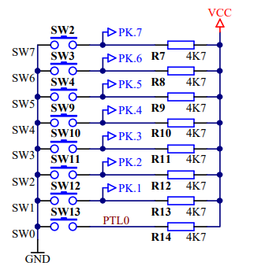
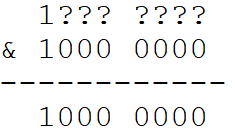
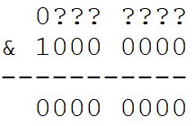

# Práce s tlačítky

V předchozích cvičeních jsme se naučili nastavit piny jako výstupní pomocí registrů DDRx a měnit jejich stav pomocí registrů PORTx. V této kapitole se naučíme nastavit piny jako vstupní a číst jejich stav. Použijeme k tomu tlačítka na našem přípravku.

## Jak funguje tlačítko
Ze schématu přípravku můžeme zjistit, že tlačítka jsou připojena na port K. Piny portu K jsou připojeny přes relativně velký odpor (4.7kΩ) k Vcc, tedy k +5V. Pokud tlačítko není stisknuto, "naměří" procesor na pinu 5V a vyhodnotí to jako logickou jedničku. 
Pokud ovšem tlačítko stiskneme, pin tím připojíme bez odporu přímo na zem. Procesor pak na pinu "naměří" 0V a vyhodnotí to jako logickou nulu. 
### Pull-up odpory
Těm 4.7kΩ rezistorům se říká pull-up odpory. Jsou důležité proto, aby i v případě, že tlačítko není stisknuto, byla na pinu jasně definovaná úroveň. Bez těchto odporů by v nestisknutém stavu pin nebyl k ničemu připojen a jeho stav by byl nedefinovaný (mohl by být snadno ovlivněn jakýmkoli náhodným blízkým elektrickým polem, rušením atd.) Hodnota odporu pullup rezistoru není nijak kritická. Pouze pokud ji zvolíte moc nízkou, při stisknutí tlačítka vám poteče do země zbytečně vysoký proud.Pokud zvolíte odpor příliš vysoký, je pak klidová úroveň "slabá" tedy dokáže ji ovlivnit rušení nebo např svodový odpor vzniklý vlhkostí. Proto se obvykle používají jednotky kiloohmů.




## Čtení stavu pinu

Na našem přípravku míme tlačítka připojena na portu K, proto všechny piny portu K nastavíme jako vstupy - do registru DDRK zapíšeme samé nuly:

 ```c
DDRK = 0x00;
```

Pro nastavení logické úrovně pinu procesoru jsme používali registr PORTx. Ovšem pozor, tento registr je pouze výstupní, tedy slouží k zápisu na pin, ale ne k jeho čtení! Ke čtení stavu pinu slouží jiný registr - PINx. V našem případě chceme číst stav tlačítek na portu K, tedy použijeme registr PINK. Jeho přečtením získáme stav všech pinů. Nás ale obvykle zajímá stav pinů jednotlivě, např. chceme zjistit, zda je stisknuto tlačítko úplně vlevo na přípravku (SW7).

Abychom z celého registru PINK vybrali pouze stav jednoho tlačítka, můžeme použít známý výraz s logickým součinem a bitovým posunem:

 ```c
(PINK & (1<<7))
```

Tento výraz nám vynuluje všechny bity, které nás nezajímají (tedy všechny kromě bitu 7.

Pokud je bit 7 jednička (tlačítko není stisknuto), tak výsledek bude:



Pokud je bit 7 nula (tlačítko je stisknuto), tak výsledek bude:



Všimněte si, že pokud je tlačíko stisknuto, výsledek výrazu je vždy nula. Ale pokud tlačítko stisknuto není, hodnota výsledku závisí na tom, který bit testujeme. Např. kdybychom testovali bit 3 tak výraz bude ```PINK & (1<<3)``` a pokud bude bit 3 jednička, tak výsledek bude 0b0000 1000. Proto při psaní podmínky používáme buď ```PINK & (1<<x) == 0``` a nebo ```PINK & (1<<x) != 0```

Podmínku, aby se chování programu měnilo podle stisku tlačítka tedy můžeme napsat třeba takto:

 ```c
if((PINK & (1<<7))==0){ 
// udělej něco když je na PK7 log.0 (tlačítko stisknuto)       
}  
```

nebo opačně:

 ```c
if((PINK & (1<<7)) != 0){ 
// udělej něco když je na PK7 log.1 
}
```


Pokud chceme někde náš program zastavit a pokračovat až po stisku tlačítka, můžeme použít prázdný cyklu while:

 ```c
while((PINK & (1<<7)) != 0){ 
// čekej, dokud je na PK7 log.1 tedy čekej, dokud tlačítko není stisknuto
// po stisku tlačítka tato smyčka končí a vykoná se program pod ní
}
```

Nebo naopak, můžeme něco dělat pouze po dobu, kdy je tlačítko stisknuto. Když tlačítko pustíme,cyklus skončí

 ```c
while((PINK & (1<<7)) == 0){ 
// příkazy v cyklu se budou vykonávat dokud je pin 7 portu K v logické nule (tlačítko stisknuto)
// po uvolnění tlačítka tato smyčka končí a vykoná se program pod ní
}
```

## Příklad s rozsvěcením LEDky

```c
#include <avr/io.h> // soubor s definicemi adres registru, abychom mohli používat symbolické názvy jako "PORTB" namísto číselné adresy registru
#define F_CPU 16000000 // definice frekvence procesoru, v nasem pripade 16MHz aby správně fungovala funkce delay
#include <util/delay.h> // přidání knihovny s funkcí delay

int main()
{
	DDRK = 0b00000000; // všechny piny portu K jako vstupy
	DDRF = 0b11111111; // všechny piny portu F jako výstupy

	// nekonecna smycka
	while(1)
	{
		if((PINK & (1<<7)) == 0) // pokud je tlačítko SW7 stisknuto
		{
			PORTF |= (1 << 7); // zhasni LED7
		}
		else { // pokud tlačítko není stisknuto
			PORTF &= ~(1 << 7); // rozsviť LEDku
		}
	}
}

```

 
## Ošetření zákmitů - debouncing
Při stisku mechanických tlačíek zpravidla dochází k něžádoucímu jevu zákmitů, anglicky bouncing. To se projeví tak, že změna stavu z jedné do druhé úrovně neproběhne jednorázovým skokem, ale po krátkou dodu může úroveň "přeskakovat" tam a zpět. Je to způsobeno mechanickými vlastnostmi kontaktů tlačítka, má na to vliv např. síla a rychlost stisku. 


*Zdroj obrázku : https://fastbitlab.com/fsm-lecture-29-button-bouncing-explanation/*

Tento jev nám působí problémy, protože pokud například chceme programme detekovat stisk tlačítka, jako změnu z 1 do 0, pak kvůli zákmitům můžeme namísto jednoho stisku tlačítka detekovat falešně třebba deset stisků. Proto musíme tento jev ošetřit tak, aby nám nepůsobil problémy. To lze buď hardwarově, nejčastěji připojením kondenzátoru paralelně k tlačítku. Kondenzátor způsobí, že napětí na tlačítku se bude měnit pomaleji (zaoblí se hrana). Nebo lze zákmity odfiltrovat softwarově.

```c
#include <avr/io.h> // soubor s definicemi adres registru, abychom mohli používat symbolické názvy jako "PORTB" namísto číselné adresy registru
#define F_CPU 16000000 // definice frekvence procesoru, v nasem pripade 16MHz aby správně fungovala funkce delay
#include <util/delay.h> // přidání knihovny s funkcí delay

int main()
{
	DDRK = 0; // všechny piny portu K jako vstupy (jsou k nim připojeny LEDky)
	DDRF = 0xFF; // všechny piny portu F jako výstupy (jsou k nim připojena tlačítka)

	PORTF = 0xFE; // na začátku svítí jen levá krajní LEDka
	
	// nekonečná smyčka
	while(1)
	{
		if((PINK & (1<<7)) == 0) // pokud je tlačítko stisknuto
		{
			_delay_ms(100); // počkáme, abychom odfiltrovali zákmity
			
			if((PINK & (1<<7)) == 0) // přečteme tlačítko znovu, pokud je i po čekání stisknuto
			{
				PORTF ^= 0x1; // změníme stav LEDky na opačný 
			}
				while ((PINK & (1<<7)) == 0){} // dokud je tlačítko pořád stisknuto, budeme čekat
		}
	}
}
```

Pozor, výše uvedený způsob ošetření zákmitů patří k těm nejjednodušším, proto ho zde uvádím pro snadné pochopení. Nicméně hodí se jen pro velmi jednoduché programy, ve kterých nevadí, že procesor 100ms (což je pro něj celá věčnost) jen čeká na na čtení tlačítka a nic jiného nedělá. V praxi se používají různé jiné způsoby, které procesor takto neblokují. Hezký článek je například [tady (EN)](https://makeabilitylab.github.io/physcomp/arduino/debouncing.html).

## Úkoly

### 1. Ovládání LED tlačítkem
Naprogramujte zařízení tak, aby:
	• při stisknutí tlačítka SW7 svítila LED7, 
	• po uvolnění tlačítka LED7 zhasla. 
Použijte:
	• PINK 
	• PORTF 
	• bitový posun << 
	• bitový součin & 
	• podmínku if. 
Pozor: Tlačítko je při stisku v logické nule.

### 2. Opačná funkce
Upravte předchozí program tak, aby:
	• při stisknutém SW7 byla LED7 zhasnutá, 
	• při uvolněném SW7 byla LED7 rozsvícená. 
Otázka
Proč je LED rozsvícená právě tehdy, když tlačítko není stisknuté?

### 3. Tlačítko ovládá jinou LED
Naprogramujte:
	• SW7 → LED0 
	• SW6 → LED1 
	• SW5 → LED2 
	• SW4 → LED3 
Každé tlačítko ovládá právě jednu LED.

### 4. Dvě tlačítka – logický součet
LED0 se rozsvítí, pokud je stisknuto alespoň jedno z tlačítek:
	• SW7 
	• SW6 
Pokud není stisknuto ani jedno, LED zhasne.
Úkol navíc
Vyřešte zadání dvěma způsoby:
	1. pomocí dvou podmínek if, 
	2. pomocí bitových operací. 


### 5. Dvě tlačítka – logický součin
LED0 se rozsvítí pouze tehdy, když jsou současně stisknuta tlačítka:
	• SW7 
	• SW6 
Ve všech ostatních případech LED0 zhasne.
Doplňte pravdivostní tabulku
SW7	SW6	LED0
0	0	?
0	1	?
1	0	?
1	1	?
Nezapomeňte, že 0 znamená stisknuté tlačítko.

### 6. Tlačítko jako přepínač
Každým stisknutím SW7 změňte stav LED0:
	• první stisk → LED se rozsvítí, 
	• druhý stisk → LED zhasne, 
	• třetí stisk → LED se rozsvítí, 
	• ... 
LED tedy nereaguje na to, zda je tlačítko právě stisknuté, ale na změnu jeho stavu.
Použijte vhodné ošetření zákmitů.


### 7. Zhasnutí jedné LED bez ovlivnění ostatních
Na začátku svítí všechny LED.
Po stisknutí SW7 zhasněte pouze LED3.
Ostatní LED musí zůstat beze změny.
Použijte:

PORTF &= ...
Otázka
Proč bychom zde neměli použít:

PORTF = ...

### 8. Přepnutí jedné LED
Po každém stisknutí SW7 změňte stav LED3:

svítí → zhasne
zhasne → svítí
Použijte operaci XOR:

PORTF ^= (1 << 3);
Otázka
Co přesně udělá operátor ^ s bitem, pokud na něj aplikujeme masku obsahující jedničku?


## Další zajímavé zdroje informací
[Ovládání portů, debouncing](http://www.elektromys.eu/clanky/avr_porty/clanek.html)

[Debouncing](https://makeabilitylab.github.io/physcomp/arduino/debouncing.html)

### [Zpět na obsah](README.md)
