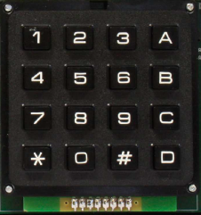
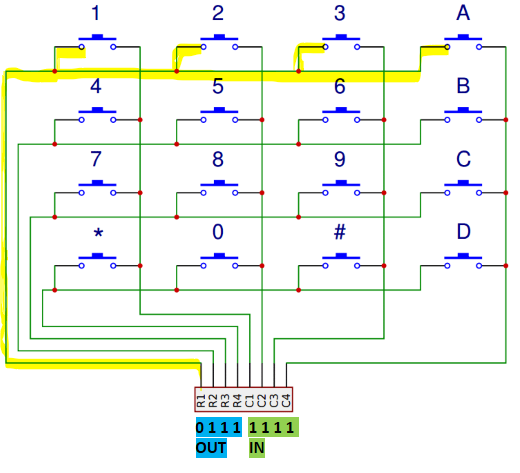
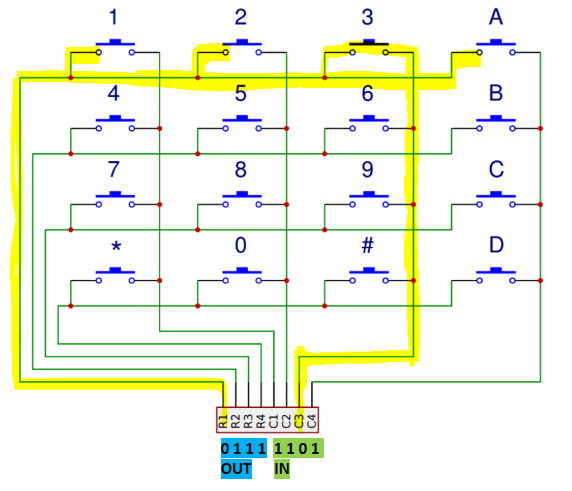

# Klávesnice

Další periferií, kterou se naučíme využívat spolu s mikroprocesorem je klávesnice. Už umíme pracovat s jednotlivými tlačítky. Mohli bychom si tedy jednoduchou 4x4 klávesnici vyrobit tak, že bychom k procesoru připojili 16 tlačítek. To by šlo, ale zabrali bychom tím 16 vstupních pinů procesoru, což je hodně. V praxi se používá maticové uspořádání klávesnice, kde si vystačíme jen s polovičním počtem pinů.



## Elektrické schéma klávesnice
Tlačítka na klávesnici, kterou máme na našem přípravku jsou elektricky zapojena jako na obrázku níže. Každá klávesa je vlastně tlačítko. Všechna tlačítka jsou zapojena tak, že jedna strana všech tlačítek ve stejném řádku je spojena. A podobně druhá strana všech tlačítek ve stejném sloupci je spojena. Pokud tlačítko stiskneme, spojíme tak vlastně jeho řádek (row) a sloupec (column).


*Zdroj obrázku: https://www.circuitbasics.com/how-to-set-up-a-keypad-on-an-arduino/*

## Princip detekce stisknuté klávesy
Klávesnici máme připojenu k mikrokontroleru pomocí osmi pinů. Piny R1-R4 které jsou připojeny k řádkům (rows) jsou nastaveny jako výstupní. Vždy jeden z nich nastavíme do nuly a ostatní do jedničky. Piny C1-C4 připojené ke sloupcům (columns) nastavíme jako vstupní - budeme číst jejich stav. Budeme klávesnici kontrolovat řádek po řádku. Vždy příslušný řádek nastavíme do nuly a přečteme hodnoty ze sloupců. Pokud žádné tlačítko není stisknuto, všechny sloupce budou v logické 1 (drží je v ní pullup odpory uvnitř procesoru). Pokud je ale nějaké klávesa stisknuta, pin příslušného sloupce bude v logické 0 (protože ho stisknuté tlačítko propojilo s nulou, ketrou jsme nastavili na daný řádek.

### Stav bez stisku klávesy 

Na obrázku je zobrazen stav, kdy testujeme první řádek - zapíšeme do pinu R1 logickou 0 a přečteme stav všech sloupců. Protože jsou všechny sloupce v logické 1, víme, že není v daném řádku stisknuta žádná klávesa.




### Stav při stisknu klávesy

Opět testujeme první řádek zapsáním nuly do R1. Tentokrát ale na pinu sloupce C3 přečteme logickou 0. Víme tedy, že klávesa na prvním řádku a třetím sloupci je stisknuta.




## Program pro detekci stisknuté klávesy

Nejprve se podíváme, jak máme klávesnici v našem přípravku zapojenu, pohledem do schématu vidíme, že je připojena na port E. Spodní čtyři bity (0-3) jsou připojeny k řádkům, horní čtyři bity (4-7) ke sloupcům. 


Víme, že do řádků chceme zapisovat, zatímco ze sloupců chceme číst. Proto spodní polovinu portu E nastavíme jako výstup, horní jako vstup:

```DDRE = 0x0f;  //=0b00001111; ```


Protože kód pro detekci klávesy už je docela dlouhý, je lepší si pro něj vytvořit vlastní funkci, kterou pak můžeme kdekoli v programu zavolat.

```c
unsigned char cti_klavesnici()
{
	// Pole s definicí hodnot kláves * jsme určili jako 14 a # jako 15
	unsigned char vystup[16]={1,2,3,10, 
                                  4,5,6,11,
                                  7,8,9,12,
                                  14,0,15,13};
							  
	int index = 0; // Proměnná pro počítání, kolikátou klávesu testujeme
	
	for(int radky=3;radky>=0;radky--) // Otestuj postupně všechny řádky
	{
		PORTE=~(1<<radky); //Zapiš nulu na aktuální řádek

		for(int sloupec=4; sloupec<8; sloupec++) // Otestuj postupně všechny sloupce
		{
			if((PINE &(1<<sloupec))==0) // Otestuj, zda je aktuální sloupec 0 (klávesa stisknuta)
			{
				return(vystup[index]); //Vrať číslo stisknuté klávesy
			}
			else // Pokud není klávesa stisknuta
			{
				index++; // Zvýšíme index aktuálně testované klávesy
			}
		}
	}
	return 255; // Pokud není stisknuta žádná klávesa, vrať 255
}
```

Zkusíme naši funkci pro čtení klávesnice použít. Ukázkový program čte klávesnici, pokud je stisknuta klávesa menší než 5, rozsvítí spodní čtyři LEDky, pokud je stisknuta vyšší klávesa, rozsvítí horní čtyři LEDky.

```c
int main(void)
{
	DDRF = 0xff; // Port F s LEDkami nastavíme jako výstup
	DDRE = 0x0f; // Port E, kde je připojena klávesnice - bity s řádky jsou výstupy, bity se sloupci vstupy
	PORTF = 0xff; // Na začátku všechny LEDky zhasneme
	
	unsigned char cislo; // Proměnná, do které si uložíme číslo stisknuté klávesy
	
	while (1) // Nekonečná smyčka
	{
		cislo = cti_klavesnici(); // Do proměnné uložím výsledek funkce
		
		if (cislo != 255) // Kód níže se provede pouze poku funkce vrátila něco jiného než 255 (pouze pokud je nějaká klávesa stisknutá)
		{ 
			if (cislo < 5)	// Pokud je stisknutá klávesa menší než 5
			{
				PORTF = 0xF0; // Rozsvítíme dolní 4 LEDky
			}
			else
			{
				PORTF = 0x0F; // Pokud ne, rozsvítíme horní 4 LEDky
			}
		}
	}
}
```

## Úkoly

**1.** Napište program, který číslo stisknuté klávesy zobrazí binárně pomocí LEDek (zapište ho do registru PORTF)
 
**2.** Napište program, který číslo stisknuté klávesy zobrazí na sedmisegmentovém displeji

**3.** Napište program, který po stisku klávesy začne odpočítávání na sedmisegmentovém displeji. Např. pokud stisknu klávesu 6, rozběhne se na 7seg displeji odpočet od 6 do 0 po 500ms.


### [Zpět na obsah](README.md)
