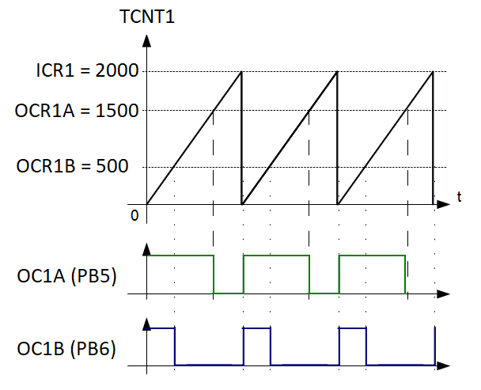
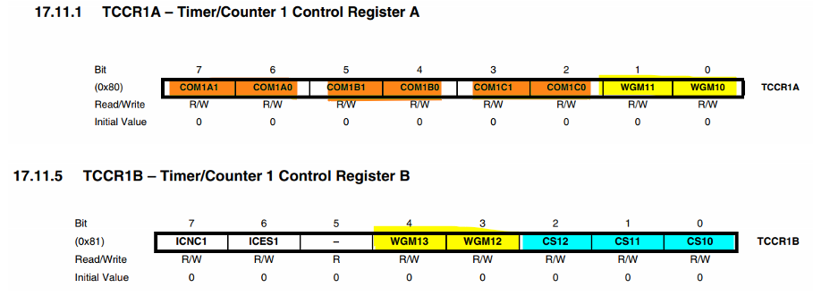

 

# PWM

PWM (pulzně šířkovou modulaci) můžeme využít například k regulaci rychlosti motoru, jasu LEDky nebo k řízení servomotoru. U PWM signálu jsou dvě důležité veličiny - frekvence [Hz] a střída, neboli duty cycle [%] . Střída nám udává poměr času, kdy je signál v log.1 k délce celé periody. Tedy například DC=30% při frekvenci 1kHz znamená, že signál je 0,3ms v logické jedničce a 0,7ms v logické nule.

*Zdroj obrázku: https://arduinokitproject.com/pwm-in-arduino/*

## Výběr režimu časovače

V tomto cvičení budeme využívat Timer1, tedy 16bitový čítač. Tento čítač umí generovat PWM signál až na třech výstupech a to zcela automaticky, bez použití jádra procesoru. Tedy časovač jen na začátku programu nastavíme a generování PWM signálu se děje již bez přispění jádra (tj. nemusíme pro něj psát žádný kód). Pouze pokud budeme chtít parametry PWM signálu změnit, např. nastavit jinou střídu, pak musíme samozřejmě použít příkaz pro změnu nastavení časovače.

V datasheetu vidíme, že Timer1 má 15 různých režimů (s režimy normal a CTC už jsme se setkali v předchozích cvičeních). Tentokrát si vybereme si mód 14, tedy Fast PWM, kde můžeme nastavit délku periody registrem ICR1 a střídu jendotlivých signálů pomocí OCR1A, OCR1B a OCR1C.

## Nastavení Fast PWM režimu

Jak funguje PWM v módu 14 (a při nastavení neinvertujícího módu) vidíme na obrázku níže. Časovač Timer1 může generovat PWM signál až na 3 výstupních pinech (OC1A, OC1B, OC1C). Časovač čítá v registru TCNT1 od nuly až do maximální hodnoty, která je uložena v registru ICR1. Při přetečení (nastavení čítače zpět do nuly) nastaví výstupní pin na 1. Při shodě čítače s komparačním registrem OCR1A nastaví pin OC1A zpět do nuly. Stejně je to se zbylými dvěma piny - shoda s registrem OCR1B vynuluje pin OC1B a stejně tak shoda s registrem OCR1C vynuluje pin OC1C.

Začneme nastavením řídícího registru časovače

Přehled hodnot předděličky a odpovídajících period časovače:

Vybereme neinvertující režim:

## Nastavení střídy na jednotlivých pinech

Mikroprocesor ATmega 2560 má piny, na kterých mohou jednotlivé časovače nastavovat PWM signál napevno přiděleny. V datasheetu tak najdeme, že pro Timer1 jsou použity tyto piny:

| Výstup časovače| Pin         |
|:--------------:|:-----------:|
| OC1A           | PB5         |
|OC1B            | PB6         |
| OC1C           | PB7         |

Již víme, že frekvenci PWM signálu v režimu 14 nastavíme pomocí registru ICR1. Pokud například chceme 10Hz, tedy periodu 100ms: 

Zkusíme zvolit předděličku 64. Pokud by nám na konci vyšlo číslo > 65535, museli bychom zvolit předděličku vyšší.

$$
\Large f_{\text{timer}} = \frac{f_{\text{osc}}}{Prescaler} = \frac{16MHz}{64} = 250kHz
$$

Spočítáme, jak dlouho trvá jeden "tick" tj. navýšení čítacího registru časovače o jedničku:

$$
\Large T_{\text{tick}} = \frac{1}{f_{\text{timer}}} = \frac{1}{250kHz} = 4us
$$

Spočítáme, kolik ticků potřebujeme pro naši požadovanou periodu. Od výslekdu ještě odečteme 1.

$$
\Large ICR1 = \frac  {T_{\text{required}}} {T_{\text{tick}}} -1 = \frac  {100ms} {4us} -1 = 24999
$$

**Pro ICR1 = 24999**

| Compare registr| Hodnota    |Duty cycle  |
|:--------------:|:----------:|:----------:|
| OCR1A          | 2499       |10%         |
| OCR1B          | 12499      |50%         |
| OCR1C          | 24999      |100%        |

## Úkoly

**1.** Chceme si připojit k procesoru RGB LEDku a nastavovat její barvu tím, jak budeme měnit PWM signál jednotlivých barev. Abychom okem nevnímali blikání, zvolíme frekvenci třeba 100Hz. Nastavte PWM výstup tak, aby RGB LEDka svítila růžovou barvou (tj. např. red = 50%, green = 0%, blue = 30%)
  - Nastavte piny, kde je připojena LEDka jako výstupy (registr DDRB, 0 vstup / 1 výstup)
  - Vyberte vhodnou předděličku pro požadovanou frekvenci
  - Nastavte předděličku a PWM režim v registrech TCCR1A a TCCR1B
  - Spočítejte hodnotu periody a uložte ji do registru ICR1
  - Do registrů OCR1A/B/C nastavujte hodnoty podle požadované střídy
  - RGB LEDku musíme připojit na výstupní piny časovače:

    | LED pin | MCU Pin     |Compare registr|
    |:-------:|:-----------:|:-------------:|
    | Red     | PB5         |OCR1A          |
    | Green   | PB6         |OCR1B          |
    | Blue    | PB7         |OCR1C          |
    | Cathode | GND         |               |
        
**2.** Nastavujte postupně ve funkci main hodnoty registrů OCR1A, OCR1B a OCR1C tak, aby každou 1s LEDka svítila jinou barvou - žlutá -> oranžová -> modrozelená.

**3.** Pomocí cyklu for měňte plynule barvu LEDky z modré na zelenou a zpět.

**4.** Připojte k přípravku servomotor a pohybujte s ním mezi 0° a 90°. Frekvenci a duty cycle nastavte podle obrázku:

*Zdroj obrázku: https://howtomechatronics.com/how-it-works/how-servo-motors-work-how-to-control-servos-using-arduino/*

Zem a PWM vstup serva zapojte stejně jako u RGB LEDky, 5V pro napájení serva najdete na přípravku zde:

## [Zpět na obsah](README.md)

