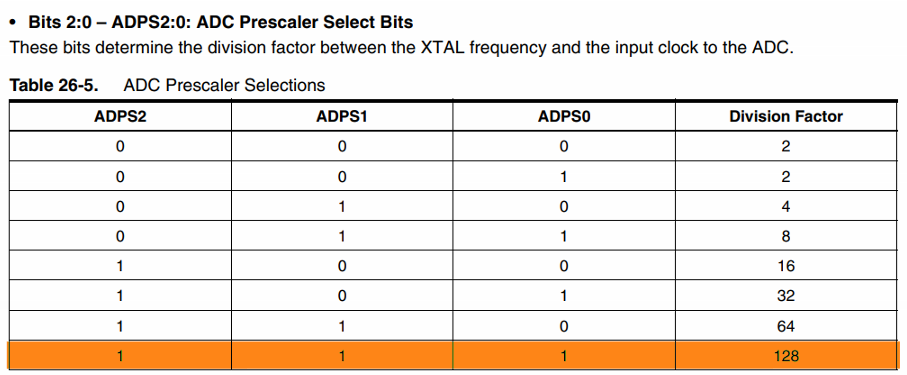
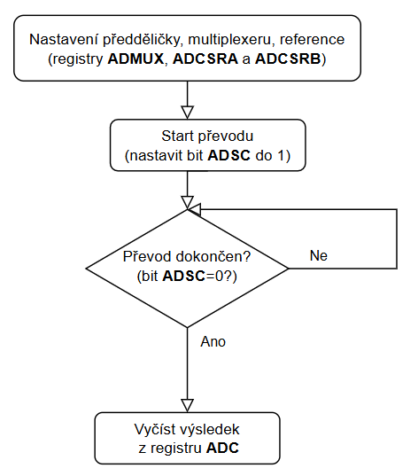
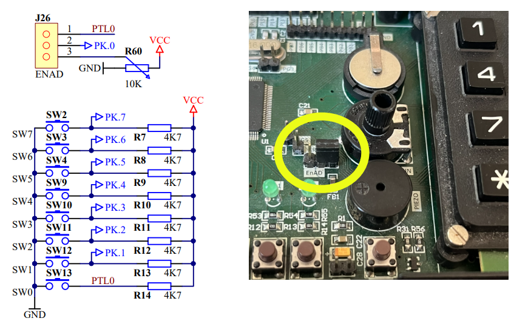

<script type="text/javascript" id="MathJax-script" async src="https://cdn.jsdelivr.net/npm/mathjax@3/es5/tex-svg.js"> </script>

# AD převodník

Mikroprocesor jako digitální součástka dokáže pracovat pouze s digitálním signálem. Stav svých pinů čte pouze jako logickou jedničku nebo logickou nulu. Co když ale chceme měřit analogové hodnoty? Například výstupní napětí z teplotního čidla, nebo napětí baterie, abychom zjistili stav jejího nabití? K tomu slouží analogově digitální převodník - ADC. 

Většina mikrokontrolerů, včetně toho v našem přípravku, má jeden nebo více ADC integrovaný ve svém pouzdře. AD převodník nám převede analogové napětí na vstupním pinu na digitální hodnotu, se kterou pak procesor může dále pracovat.


*Zdroj obrázku: https://www.linkedin.com/pulse/ultimate-adc-guide-everything-you-need-know-hybrique-sg/*

## Rozlišení AD převodníku
Rozlišení AD převodníku (analogově-digitálního převodníku) určuje, na kolik diskrétních hodnot může převodník rozdělit vstupní analogový signál. Udává se v bitech a definuje počet možných úrovní výstupu.
Například 8bitový převodník má  2^8 tedy 256 úrovní, 10bitový převodník má 2^10 tedy 1024 úrovní. Vyšší rozlišení znamená jemnější odstupňování měření, což vede k přesnějším výsledkům.


*Zdroj obrázku: https://docs.madmachine.io/learn/peripherals/potentiometer*

## Referenční napětí
AD převodník funguje poměrově (ratiometric) to znamená, že hodnota jeho výstupu udává poměr měřeného napětí a referenčního napětí. 

$$
DigitálníHodnota = RozlišeníADC \times \frac{Vin}{Vref}
$$

Například u 10bitového ADC, kde Vref je 5V a měřené napětí je 2,5V:

$$
DigitálníHodnota = 1023 \times \frac{2,5}{5}
$$

$$
DigitálníHodnota = 512
$$

Zdroj referenčního napětí si můžeme zvolit. Může jím být napájecí napětí mikrokontroleru, vnitřní zdroj referenčního napětí či externě připojený zdroj referenčního napětí (např. speciální obvody, jako je LM4040 nebo LM336).

## Předdělička hodinového signálu
Podobně jako u časovače, musíme nastavit, s jakou frekvencí hodinového signálu bude AD převodník pracovat. Do jisté míry platí, že čím bude převod rychlejší, tím méně bude přesný a naopak. AD převodník použitý v ATmega 2560 vyžaduje frekvenci mezi 50kHz a 200kHz.

## Multiplexer
Protože AD převodník je v čipu mikrokontroleru jen jeden, ale je užitečné mít možnost měřit analogové napětí na více pinech, lze pomocí multiplexeru připojit AD převodník k různým pinům. Výběr pinu musíme samozřejmě provést před spuštěním měření.


## Důležité registry


**ADEN** - Nastavení tohoto bitu zapne AD převodník. Pokud převodník nepoužíváme, jeho vypnutím můžeme snížit spotřebu energie.

**ADSC** - Start AD převodu. Zápisem jedničky spustíme převod. Po dokončení převodu se bit automaticky nastaví do nuly. Toho můžeme využít pro detekci toho, zda už je převod dokončen.

**ADPS0:2** - Nastavení předděličky hodinového signálu viz tabulka níže.


**MUX0-5** - Nastavení multiplexeru, tedy výběr pinu, na kterém budeme měřit napětí. Pozor, pátý bit MUX5 je umístěn v registru ADCSRB

**REFS0-1** - Nastavení zdroje referenčního napětí, viz tabulka níže


**MUX5** - nejvyšší bit pro nastavení multiplexeru (zbytek bitů je umístěn v registru ADMUX)





## Použití ADC


1. Nastavit multiplexer podle toho, na kterém pinu chceme měřit (v našem případě máme potenciometr připojen na pinu PK0 tedy ADC8)
2. Nastavit předděličku hodinového signálu - čím vyšší hodnota, tím pomalejší, ale přesnější převod. V našem případě můžeme klidně použít nejvyšší hodnotu.
3. Nastavit zdroj referenčního napětí - napětí na potenciometru se bude pohybovat od 0V do 5V, proto vybereme jako zdroj referenčního napětí napájecí napětí Vcc, které je také 5V.
4. Spustit konverzi zápisem jedničky do bitu ADSC.
5. Čekat, dokud se konverze nedokončí. Buď cyklicky vyčítat, zda je bit ADSC už v nule (polling) nebo použít přerušení.
6. Po dokončení konverze je výsledek v registru ADC (16bitový registr).

## Zapojení potenciometru v přípravku
Na našem přípravku je osazen potenciometr, který využijeme k ukázce funkce AD převodníku. Ovšem potenciometr není připojen k mikroprocesoru napevno, ale sdílí pin PK.0 spolu s tlačítkem SW0. TO, jestli je k mikroprocesoru připojen potenciometr nebo tlačítko, ovládáme jumperem EnAD. Jumper v poloze vlevo připojuje na pin PK.0 tlačítko SW0, jumper v poloze vpravo (jako na obrázku níže) připojuje na pin PK.0 potenciometr. Zkontorlujte tedy, že máte jumper zapojen jako na obrázku níže.



## Úkoly

**1.** Měřte pomocí ADC napětí na potenciometru a zobrazujte jej na LCD displeji (přímo výstup z registru ADC, tedy číslo v rozsahu 0-1023)
- Naprogramujte AD převodník podle flowchartu výše
- Přidejte do projektu knihovnu pro [LCD displej](12_LCD.md)
- Pomocí funkce [sprintf](12_LCD.md#ascii-k%C3%B3d-funkce-sprintf) zobrazujte na displeji výsledek převodu

**2.** Přepočítejte výslednou hodnotu převodu na napětí ve voltech.
- Pozor, pro správné zobrazení desetinných čísel použijte [návod z minulé lekce](https://tomaschovanec.github.io/MIT/12_LCD.html#p%C5%99id%C3%A1n%C3%AD-podpory-desetinn%C3%BDch-%C4%8D%C3%ADsel). Formátovací parametr ve funkci sprintf pro desetinná čísla můžete použít ```"%.2f"``` (číslo udává počet desetinných míst).
- Pozor, v jazyce C je rozdíl mezi ```5/3``` a ```5.0/3``` v typu operace:
    - ```5/3``` je celočíselné dělení (integer division), protože oba operandy jsou celá čísla (int). Výsledek je 1, protože desetinná část se ořízne.
    - ```5.0/3``` je desetinné dělení (floating-point division), protože alespoň jeden operand je float. Výsledek je přibližně 1.6667.
    - Pokud chcete, aby 5/3 vrátil desetinné číslo, stačí alespoň jeden operand přetypovat. Např. ```((float)5)/3``` nebo ```5/3.0```. 

**3.** Změřte multimetrem napětí přímo na potenciometru. Je výsledek změřený multimetrem stejný jako výsledek AD převodu na displeji? Pokud ne, čím je rozdíl způsoben?

**4.** Nastavujte potenciometrem rychlost blikání LEDek. Periodu blikání zobrazujte v milisekundách na LCD displeji.

**5.** Zapínejte LEDky podle polohy potenciometru (0V - nesvítí žádná LED, 5V - svítí všechny, 2.5V - svítí 4 LEDky atd).

### [Zpět na obsah](README.md)

