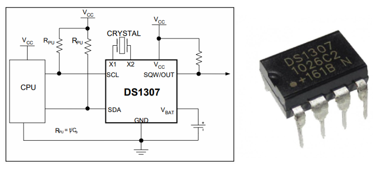
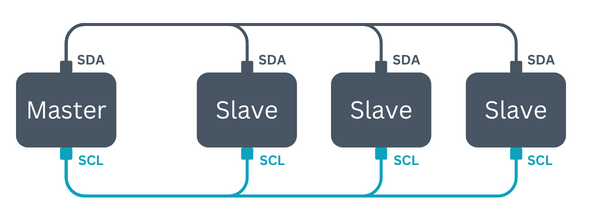

# RTC - Real time clock

RTC modul (Real-Time Clock), je specializovaný integrovaný obvod, který uchovává přesný čas a datum i při výpadku napájení díky zabudované záložní baterii.
S mikroprocesorem komunikuje přes I2C sběrnici. Záložní baterie (obvykle malá knoflíková, v našem případě CR1225) zajišťuje chod i bez hlavního napájení. V našem přípravku máme osazen RTC modul DS1307 [(datasheet zde).](https://www.analog.com/media/en/technical-documentation/data-sheets/ds1307.pdf)

K RTC obvodu se obvykle připojuje krystal o frekvenci 32,768 kHz. Proč zrovna tato hodnota? Protože 32 768  je mocnina dvou (2¹⁵ = 32 768), to znamená, že RTC obvod může tuto frekvenci 15krát vydělit dvěma a dostane přesně 1 Hz – tedy jeden puls za sekundu. Díky tomu není potřeba složitý dělicí obvod, stačí jednoduchý binární čítač.



## I2C (TWI) komunikace - základy, adresa, master/slave
I²C (Inter-Integrated Circuit, u Atmelu označována TWI) je sériová sběrnice pro komunikaci mezi mikrokontroléry a periferiemi. Používá dva signální vodiče:
SDA (Serial Data) – přenos dat
SCL (Serial Clock) – hodinový signál

Komunikace probíhá v režimu master-slave, kde master řídí přenos. Každé zařízení má unikátní adresu a lze připojit více zařízení na stejné dvě linky. Hezký článek o I2C komunikaci [zde](http://www.elektromys.eu/clanky/ele_i2c/clanek.html). A další článek o různých dalších [sběrnicích](https://www.hibit.dev/posts/102/communication-protocols-uart-i2c-and-spi)


 
*Zdroj obrázku: https://www.hibit.dev/posts/102/communication-protocols-uart-i2c-and-spi*


## Registry DS1307
Pomocí I2C sběrnice můžeme vyčítat nebo zapisovat obsah registrů DS1307. V datasheetu najdeme rozložení jednotlivých časových údajů:


## RAM paměť v DS1307
RTC čip DS1307 obsahuje kromě obvodu reálného času i 56 bajtů RAM paměti. Ta je sice napěťově závislá (narozdíl od paměti EEPROM) a bez napájení se data ztratí, ale tím, že má modul vlastní baterii, data zůstanou zachována i když odpojíme napájecí adaptér přípravku. Paměť lze libovolně číst a zapisovat přes I²C sběrnici. Využít ji můžeme například k ukládání uživatelských dat a parametrů, které by měly zůstat zachovány i po vypnutí napájení. Adresa RAM v DS1307 začíná od 0x08 a končí na 0x3F.


## Knihovny pro I2C a DS1307
Pro usnadnění práce můžeme použít hotové knihovny pro I2C a  RTC obvod DS1307 [i2c.c](files/i2c.c),  [i2c.h](files/i2c.h), [DS1307.c](files/DS1307.c), [DS1307.h](files/DS1307.h). Knihovny přidáte stejně jako [knihovnu pro LCD](https://tomaschovanec.github.io/MIT/12_LCD.html). Projděte si zejména soubor [DS1307.h](files/DS1307.h) kde najdete deklarace funkcí, které knihovna obsahuje.


## Úkoly
1. Zobrazte na LCD displeji čas a datum. 
    - Přidejte si do projektu potřebné knihovny. Stáhněte si následující soubory (přes pravé tlačítko a *Uložit odkaz jako*): [i2c.c](files/i2c.c),  [i2c.h](files/i2c.h), [DS1307.c](files/DS1307.c), [DS1307.h](files/DS1307.h), [lcd.c](files/lcd.c) a [lcd.h](files/lcd.h).
    - Na začátek programu přidejte include všech přidaných knihoven:
    
    ```c
    #include "lcd.h" // knihovna pro práci s LCD displejem
    #include <stdio.h> // tato knihovna obsahuje funkci sprintf()
    #include "i2c.h" // knihovna pro práci s I2C sběrnicí
    #include "DS1307.h" // knihovna pro ovládání RTC obvodu DS1307
    ```
    
    - Na začátku funkce ```main()``` také musíte inicializovat I2C komunikaci. K tomu slouží funkce ```i2c_ini();```.
    - Funkce pro získání času najdete v souboru [DS1307.h](files/DS1307.h) . Začněte nejprve zobrazením sekund. Pokud by RTC modul vracel hodnotu sekund 80, znamená to, že je RTC modul zastaven (bit Clock Hold (CH) na adrese 0x00 je nastaven v log. 1. To napravíte tak,     že bit CH vynulujete, např. takto: ``` DS1307_set_seconds(0);```.

2. Pokud není na RTC přesný čas, nastavte jej funkcemi ```DS1307_set_xx()```.

3. Napište program, který čte z RTC pouze sekundy (jednou za sekundu). Změřte I2C komunikaci pomocí logického analyzeru (signál SCL je na pinu PD.0, SDA je na pinu PD.1). Zkuste v softwaru logického analyzeru nastavit dekódování I2C sběrnice a rozlišit v datech informaci o sekundách.

4. Na displeji zobrazujte počet stisknutí tlačítka. Po odpojení a opětovném připojení napájení by se tento počet neměl vynulovat, ale pokračovat od poslední zaznamenané hodnoty. Pro ukládání počtu stisků použijte RAM v modulu DS1307 a při startu programu hodnotu načtěte zpět.


### [Zpět na obsah](README.md)
