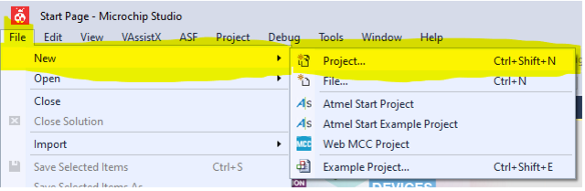
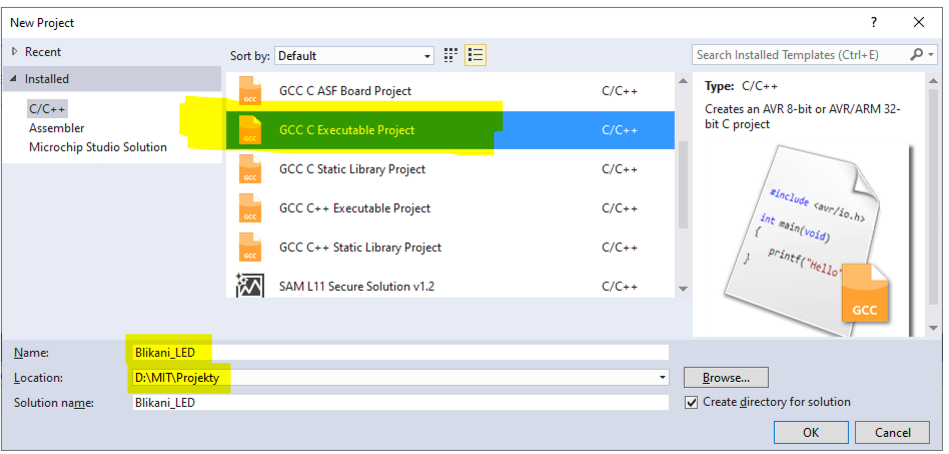
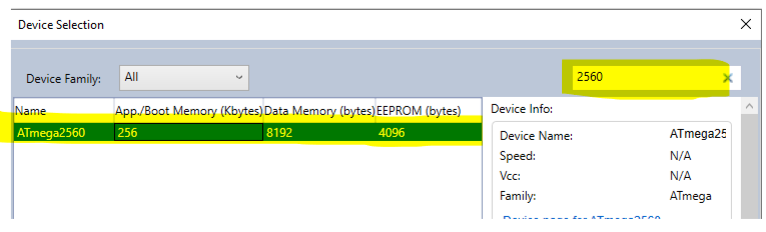
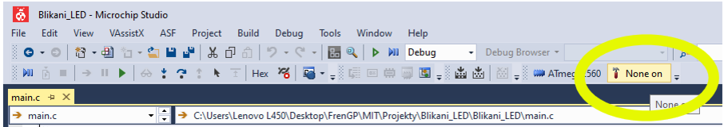
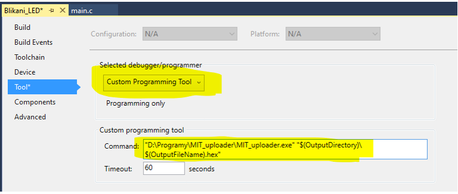

# Vytvoření projektu v Microchip studiu

Stáhněte do počítače [program pro flashování přípravku](https://github.com/TomasChovanec/MIT_uploader/raw/main/executable/MIT_uploader.zip) a rozbalte ho do ```D:/Programy/```

Spusťe Microchip Studio (dříve Atmel Studio), v menu v horní liště zvolte File -> New -> Project



Budeme zpravidla tvořit spustitelný program v C, zvolte tedy "GCC C Executable Project". 
**Pojmenujte si svůj projekt** (tématem cvičení nebo alespoň pořadovým číslem cvičení) **V názvu nepoužívejte diakritiku**, způsobuje to pak problémy při překladu kódu..



Dále musíme vybrat,  pro jaký mikrokontroler budeme program psát. My máme na přípravku osazen ATmega 2560. Nejsnažší je zadat číslo do vyhledávacího pole, a vyfiltruje se nám náš procesor.



Dále nastavíme způsob nahrávání programu do mikroprocesoru. Stiskněte na horní liště tlačítko se symbolem kladívka. Pak vyberte **"Custom Programming Tool"** a do políčka Coémmand zkopírujte následující příkaz.

```
"D:\Programy\MIT_uploader\MIT_uploader.exe" "$(OutputDirectory)\$(OutputFileName).hex"
```




